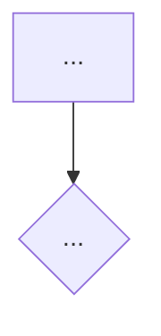
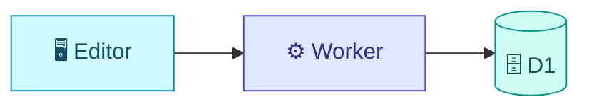
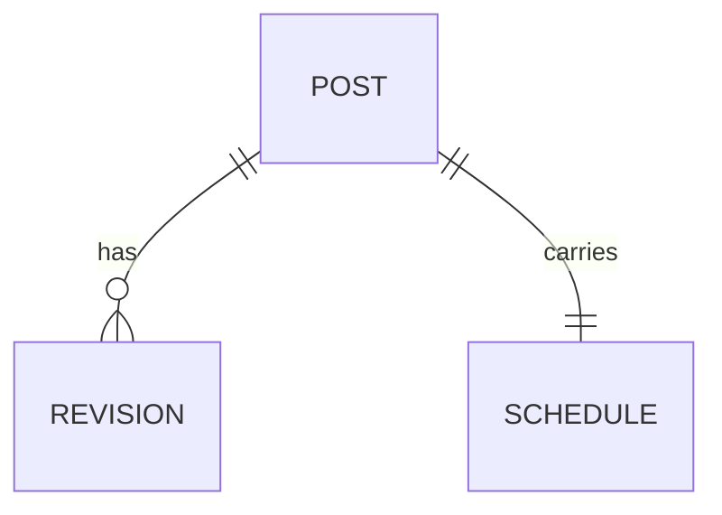
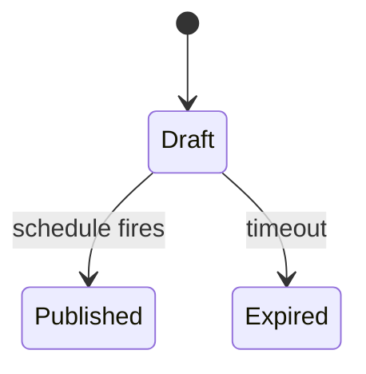

# Feature Dossier — Storage, Template & Diagram Cookbook

Spoke for `/samuel:feature-dossier`. Defines WHERE dossiers live, the canonical document template, the changelog spine, and the Mermaid recipes. The hub (`SKILL.md`) owns the process; this file owns the artifacts.

A **dossier** is a *living, canonical, technical+product reference* for one platform capability. It reflects the code **as it exists today**, plus a changelog of how it got there. It is NOT audience-tailored communication (that is `feature-brief`) and NOT a transient research doc (that is `codebase-documentation`).

---

## Storage & Catalog Conventions

Dossiers live in the **product repo**, versioned alongside the code — not in the skills repo. They sit in the **global product catalog** (`docs/product/`), organized by *capability* — deliberately separate from `docs/features/<task-slug>/` (a task's process artifacts: research/journal/validation). A capability evolves across many tasks, so it can't live under any single task dir. Full reasoning: the **Storage map** in `reference/tracker.md`.

```
docs/product/
├── README.md                       # the CATALOG index (master table of capabilities)
├── <slug>/
│   ├── README.md                   # the dossier itself (GitHub renders it as the folder page)
│   └── assets/                     # screenshots / exported diagrams (optional)
└── <other-slug>/
    └── README.md
```

- **Default root**: `docs/product/`. If the repo already has a docs convention (`docs/`, `documentation/`, no `product/`), detect it and confirm the root with the user before writing. Accept `--root <path>` to override.
- **Slug**: kebab-case, derived from the capability name (`scheduled-publishing`). A slug in the dossier's `--lang` language is fine too — pick one language per catalog and stay consistent. Reuse `feature_slug` from `.claude/task-context.md` when feature-aware.
- **One dossier per capability**, not per task/PR. A capability accretes many PRs over its life; each lands as a changelog entry, not a new file.
- **Statuses**: `🟢 Live` · `🟡 Beta` · `🔵 Planned` · `⚪ Deprecated`.

### Catalog index — `docs/product/README.md`

Regenerated on every create/update. Newest-touched first.

```markdown
# Capability Catalog — [Product]

Living reference for the platform's capabilities. Every row links to its full dossier.

> Maintained by `/samuel:feature-dossier`. The table is regenerated on every create/update — do not edit it by hand.

| Capability | Status | Summary (1 line) | Updated | Dossier |
|------------|--------|------------------|---------|---------|
| Scheduled publishing | 🟢 Live | Schedule posts in the author's timezone | 2026-06-01 | [View](./scheduled-publishing/README.md) |
| Full-text search | 🟢 Live | Incremental index over the content | 2026-05-20 | [View](./full-text-search/README.md) |
```

---

## Dossier Template — `docs/product/<slug>/README.md`

Sections marked **(conditional)** are included only when relevant. Every code claim cites `file:line` — no vague references. Content is written in the dossier's `--lang` language (**default English**); technical terms (APIs, components, file paths) always stay in English. Pass `--lang es` to write the same structure in Spanish.

```markdown
# [Capability Name]

| | |
|---|---|
| **Status** | 🟢 Live |
| **Slug** | `scheduled-publishing` |
| **Version** | v2.5 |
| **Owner** | [team/person] |
| **Issues/RFC** | [#123, links] |
| **Key PRs** | [#456, #470] |
| **Updated** | 2026-06-01 |

## What it does

[2-4 sentences in product language. What it solves, for whom, what value it delivers.
USER perspective, not developer perspective: "Authors can schedule a post in their
own timezone", not "added a ScheduleResolver".]

## Features

- [Concrete capability 1]
- [Concrete capability 2]
- [Concrete capability 3]

## User flow

[Numbered steps. If the flow has >3 steps or branches, add a diagram.]



## Technical architecture

[Components and where they live, with file:line. How data flows end to end.]



- **Frontend**: `src/...:NN` — [role]
- **Backend**: `worker/...:NN` — [role]

## Data model  (conditional)

[Entities/tables involved. ER diagram when the relations are non-trivial.]



## States  (conditional — only when the capability has a lifecycle)



## Integrations and dependencies

- [External API / internal module it depends on — with its contract]

## Business rules and constraints

- [Invariant, limit, or edge case a future change must not break]

## How to change this capability

[The future-reference payload. Where to touch for the typical changes, what to
break carefully, which tests cover this. For humans AND for AI.]

- For [typical change A]: edit `file:NN`, check [side effect].
- Careful with: [invariant / non-obvious coupling].

## Code references

- `path/to/file.ext:NN` — [what it does]
- `path/to/other.ext:NN-MM` — [what it does]

## Screenshots  (conditional — UI)

[Screenshot: description]  ← placeholder; ask the user for the real images.

## Changelog

| Date | Version | Change | PR |
|------|---------|--------|-----|
| 2026-06-01 | v2.5 | Timezone-aware scheduling | #470 |
| 2026-05-10 | v2.4 | Initial dossier | #456 |
```

---

## Changelog Spine (the "living" part)

On **UPDATE**, never silently overwrite. The flow is:

1. Re-read the existing dossier.
2. Re-derive current state from code + new PRs/commits since the last changelog entry.
3. Revise the affected sections in place (Features, Technical architecture, diagrams, and so on).
4. **Append** a new `Changelog` row: date, version, one-line change, PR.
5. Bump the header `Version` + `Updated`.
6. Present a summary of *which sections changed* before writing.

The changelog is append-only and is the audit trail of how the capability evolved.

---

## Mermaid — diagrams in the dossier

Every diagram follows the **style standard**: `mermaid-style.md` (same `reference/` dir; hub `/samuel:mermaid`) — semantic vocabulary, classDef palette, per-type recipes, and gotchas live THERE, not here. What's dossier-specific is the mapping from template section to diagram type:

| Template section | Diagram |
|------------------|---------|
| User flow | `flowchart TD` (decisions/branches) |
| Technical architecture | `flowchart LR` + `subgraph` per boundary |
| Data model | `erDiagram` |
| States | `stateDiagram-v2` |

Cross-service request/response inside any section → `sequenceDiagram`.
