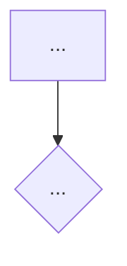
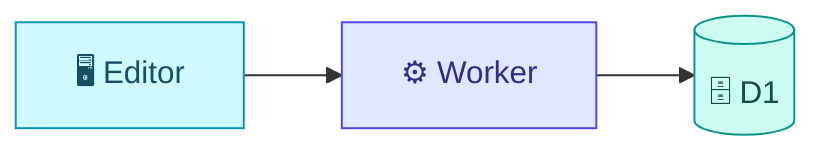
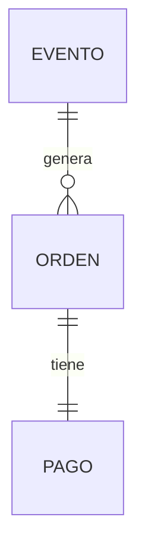
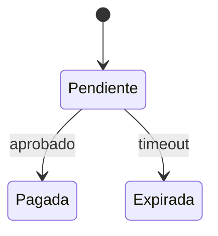

# Feature Dossier — Storage, Template & Diagram Cookbook

Spoke for `/samuel:feature-dossier`. Defines WHERE dossiers live, the canonical document template, the changelog spine, and the Mermaid recipes. The hub (`SKILL.md`) owns the process; this file owns the artifacts.

A **dossier** is a *living, canonical, technical+product reference* for one platform capability. It reflects the code **as it exists today**, plus a changelog of how it got there. It is NOT audience-tailored communication (that is `feature-brief`) and NOT a transient research doc (that is `codebase-documentation`).

---

## Storage & Catalog Conventions

Dossiers live in the **product repo**, versioned alongside the code — not in the skills repo. They sit in the **global product catalog** (`docs/product/`), organized by *capability* — deliberately separate from `docs/features/<task-slug>/` (a task's process artifacts: research/journal/validation). A capability evolves across many tasks, so it can't live under any single task dir. Full reasoning: the **Storage map** in `reference/tracker.md`.

```
docs/product/
├── README.md                       # the CATALOG index (master table of capabilities)
├── <slug>/
│   ├── README.md                   # the dossier itself (GitHub renders it as the folder page)
│   └── assets/                     # screenshots / exported diagrams (optional)
└── <other-slug>/
    └── README.md
```

- **Default root**: `docs/product/`. If the repo already has a docs convention (`docs/`, `documentation/`, no `product/`), detect it and confirm the root with the user before writing. Accept `--root <path>` to override.
- **Slug**: kebab-case, derived from the capability name (`scheduled-publishing` → `publicacion-programada` is fine — pick one language and stay consistent). Reuse `feature_slug` from `.claude/task-context.md` when feature-aware.
- **One dossier per capability**, not per task/PR. A capability accretes many PRs over its life; each lands as a changelog entry, not a new file.
- **Statuses**: `🟢 Live` · `🟡 Beta` · `🔵 Planned` · `⚪ Deprecated`.

### Catalog index — `docs/product/README.md`

Regenerated on every create/update. Newest-touched first.

```markdown
# Catálogo de Funcionalidades — [Producto]

Referencia viva de las capacidades de la plataforma. Cada entrada enlaza a su dossier completo.

> Mantenido por `/samuel:feature-dossier`. La tabla se regenera al crear/actualizar un dossier — no la edites a mano.

| Capacidad | Estado | Resumen (1 línea) | Actualizado | Dossier |
|-----------|--------|-------------------|-------------|---------|
| Publicación programada | 🟢 Live | Agendar publicaciones por zona horaria | 2026-06-01 | [Ver](./publicacion-programada/README.md) |
| Búsqueda full-text | 🟢 Live | Índice incremental sobre el contenido | 2026-05-20 | [Ver](./busqueda-full-text/README.md) |
```

---

## Dossier Template — `docs/product/<slug>/README.md`

Sections marked **(conditional)** are included only when relevant. Every code claim cites `file:line` — no vague references. Content is written in the dossier's `--lang` language (**default Spanish**); technical terms (APIs, components, file paths) stay in English. The example template below is in Spanish (the default); with `--lang en` the same structure is written in English.

```markdown
# [Nombre de la Capacidad]

| | |
|---|---|
| **Estado** | 🟢 Live |
| **Slug** | `publicacion-programada` |
| **Versión** | v2.5 |
| **Owner** | [equipo/persona] |
| **Issues/RFC** | [#123, links] |
| **PRs clave** | [#456, #470] |
| **Actualizado** | 2026-06-01 |

## Qué ofrece

[2-4 frases en lenguaje de producto. Qué resuelve, para quién, qué valor entrega.
Perspectiva de USUARIO, no de desarrollador: "Los autores pueden agendar una
publicación en su zona horaria", no "se agregó ScheduleResolver".]

## Funcionalidades

- [Capacidad concreta 1]
- [Capacidad concreta 2]
- [Capacidad concreta 3]

## Flujo de usuario

[Pasos numerados. Si el flujo tiene >3 pasos o ramas, añade un diagrama.]



## Arquitectura técnica

[Componentes y dónde viven, con file:line. Cómo fluye el dato de extremo a extremo.]



- **Frontend**: `src/...:NN` — [rol]
- **Backend**: `worker/...:NN` — [rol]

## Modelo de datos  (condicional)

[Entidades/tablas involucradas. Diagrama ER si hay relaciones no triviales.]



## Estados  (condicional — solo si la capacidad tiene ciclo de vida)



## Integraciones y dependencias

- [Pasarela / API externa / módulo interno del que depende — con su contrato]

## Reglas de negocio y constraints

- [Invariante, límite o edge case que un cambio futuro no debe romper]

## Cómo modificar esta capacidad

[El payload de referencia futura. Dónde tocar para los cambios típicos, qué
romper-con-cuidado, qué pruebas cubren esto. Para humanos Y para IA.]

- Para [cambio típico A]: editar `file:NN`, revisar [efecto colateral].
- Cuidado con: [invariante / acoplamiento no obvio].

## Referencias de código

- `path/to/file.ext:NN` — [qué hace]
- `path/to/other.ext:NN-MM` — [qué hace]

## Capturas  (condicional — UI)

[Screenshot: descripción]  ← placeholder; pedir al usuario las imágenes reales.

## Changelog

| Fecha | Versión | Cambio | PR |
|-------|---------|--------|-----|
| 2026-06-01 | v2.5 | Agendado por zona horaria | #470 |
| 2026-05-10 | v2.4 | Dossier inicial | #456 |
```

---

## Changelog Spine (the "living" part)

On **UPDATE**, never silently overwrite. The flow is:

1. Re-read the existing dossier.
2. Re-derive current state from code + new PRs/commits since the last changelog entry.
3. Revise the affected sections in place (Funcionalidades, Arquitectura, diagramas, etc.).
4. **Append** a new `Changelog` row: date, version, one-line change, PR.
5. Bump the header `Versión` + `Actualizado`.
6. Present a summary of *which sections changed* before writing.

The changelog is append-only and is the audit trail of how the capability evolved.

---

## Mermaid — diagrams in the dossier

Every diagram follows the **style standard**: `mermaid-style.md` (same `reference/` dir; hub `/samuel:mermaid`) — semantic vocabulary, classDef palette, per-type recipes, and gotchas live THERE, not here. What's dossier-specific is the mapping from template section to diagram type:

| Template section | Diagram |
|------------------|---------|
| Flujo de usuario | `flowchart TD` (decisions/branches) |
| Arquitectura técnica | `flowchart LR` + `subgraph` per boundary |
| Modelo de datos | `erDiagram` |
| Estados | `stateDiagram-v2` |

Cross-service request/response inside any section → `sequenceDiagram`.
