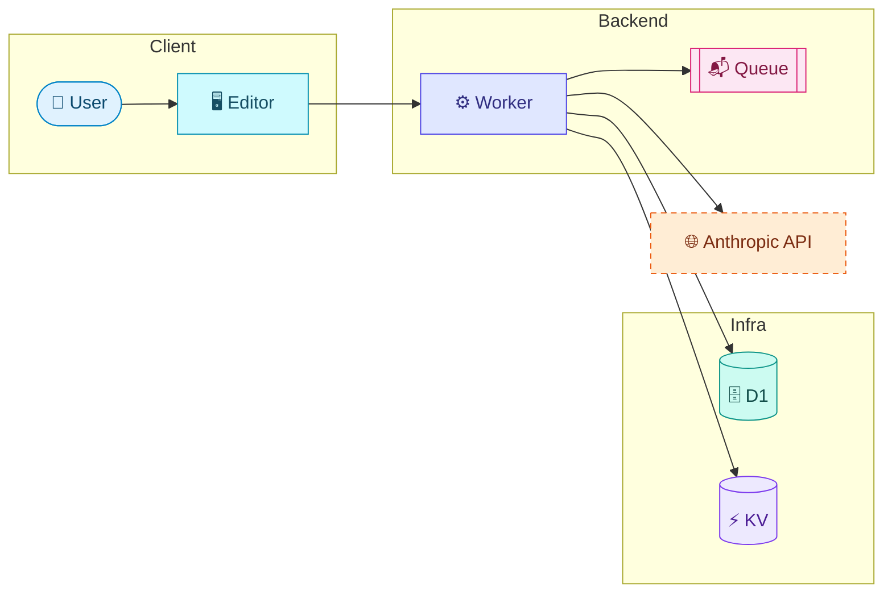
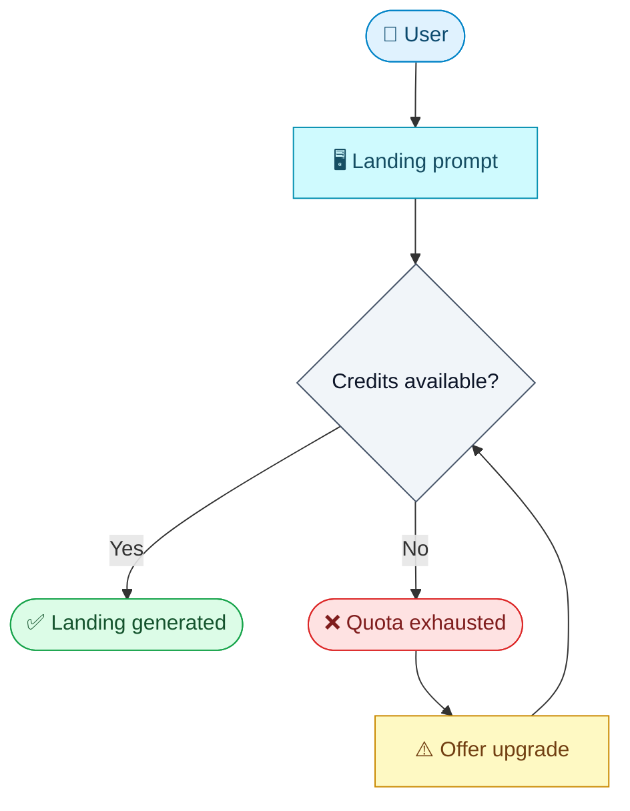
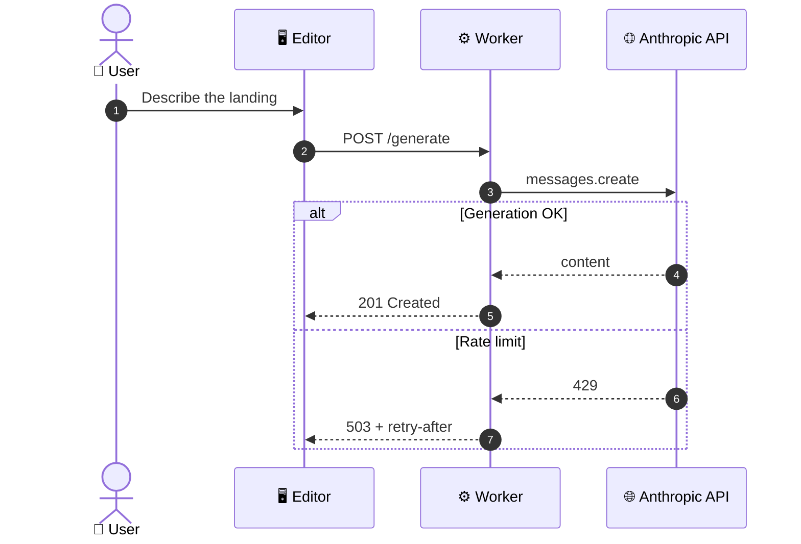
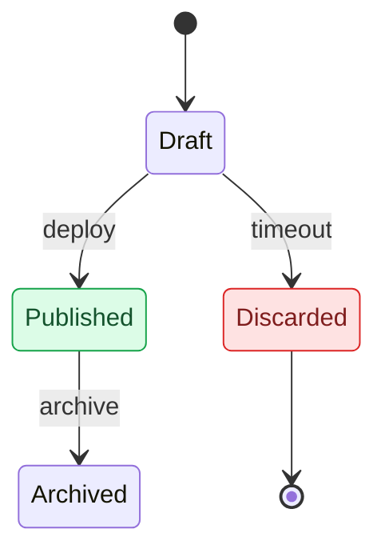
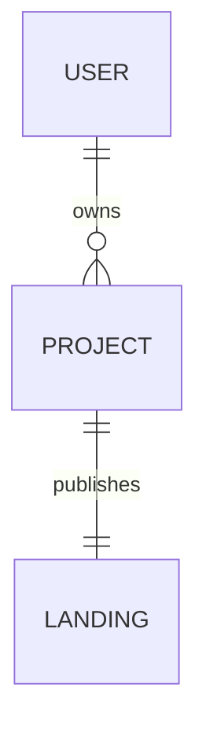

# Mermaid Style Guide — the diagram standard

Spoke for `/samuel:mermaid`. Single source of truth for HOW Mermaid diagrams are drawn on every surface these skills emit: dossiers (`docs/product/`), feature docs, API contracts, RFCs, Issue/PR bodies. The hub (`SKILL.md`) owns when-to-diagram and type selection; this file owns the visual standard — shapes, emojis, palette, per-type recipes, gotchas.

Empirical base: a render canvas run against GitHub (a dedicated render-canvas PR, branch `test/mermaid-render-check`, never merged — re-run it before changing rendering assumptions). Verdict: GitHub honors `style`/`classDef`/`linkStyle`, re-themes text per the viewer's light/dark mode, and sanitizes HTML in labels (`securityLevel: strict`). `%%{init}%%`/`themeVariables` are NOT part of the standard — unvalidated, and they fight GitHub's forced theme.

## Principles

1. **Triple encoding.** Every node's role reads three ways: **shape** (structure), **emoji** (semantic anchor), **color** (visual layer). The redundancy is deliberate — the diagram survives colorblind readers, dark mode, and renderers that ignore `classDef`.
2. **classDef-only styling.** No `%%{init}%%`, no `themeVariables`, no per-node `style` lines (classes keep diagrams consistent and diffable).
3. **Every `fill` pairs with an explicit `color`.** GitHub re-themes text per viewer mode; an unpaired fill produces unreadable contrast in one of the two modes.
4. **Text works without the emoji.** The emoji reinforces, never replaces, the label (screen readers, grep, plain-text diffs).
5. **Diagrams earn their place.** Flows >3 steps, branching logic, lifecycles, multi-service interaction, non-trivial data models. Don't diagram the trivial; split anything approaching ~15 nodes.

## Semantic vocabulary

**One emoji per node, max.** Same concept = same shape + emoji + class, in every diagram, in every repo.

| Role | Shape | Syntax | Emoji | Class |
|------|-------|--------|-------|-------|
| User / actor | Stadium | `U([👤 User])` | 👤 (👥 group) | `actor` |
| Web frontend | Rect | `FE[🖥️ Editor]` | 🖥️ | `ui` |
| Mobile client | Rect | `APP[📱 Native app]` | 📱 | `ui` |
| Internal API / service | Rect | `API[⚙️ Worker]` | ⚙️ | `svc` |
| External service | Rect (dashed via class) | `LLM[🌐 Anthropic API]` | 🌐 | `ext` |
| Database | Cylinder | `DB[(🗄️ D1)]` | 🗄️ | `db` |
| Cache | Cylinder | `KV[(⚡ KV)]` | ⚡ | `cache` |
| Queue / jobs | Subroutine | `Q[[📬 Queue]]` | 📬 | `queue` |
| Decision | Diamond | `D{Session valid?}` | — | `decision` |
| Success / terminal ok | context shape | `OK([✅ Published])` | ✅ | `ok` |
| Warning / degraded / retry | context shape | `W[⚠️ Retry]` | ⚠️ | `warn` |
| Error / failure | context shape | `F([❌ Failed])` | ❌ | `fail` |

**Specialization emojis** (no class of their own — they *replace* the base emoji while the class keeps carrying the role): 🔐 auth/security (`AUTH[🔐 AuthService]:::svc`), 📦 file/object storage (`R2[(📦 R2)]:::db`), ⏰ cron/scheduler (`CR[⏰ Scheduler]:::svc`), 📊 observability/metrics, 🪝 webhook receiver.

**Dashed border = outside our control** (`ext`): model providers, payment gateways, any third-party API. Everything you operate gets a solid border.

### Meta domain — diagramming the pipeline itself

Diagrams *about the workflow* (`pipeline.md`, skill docs, RFCs about process) need roles the product vocabulary doesn't cover. They reuse the same classes rather than inventing a parallel palette — one new class, `doc`:

| Role | Shape | Syntax | Emoji | Class |
|------|-------|--------|-------|-------|
| Skill / command | Rect | `P["⚙️ /samuel:plan"]` | ⚙️ | `svc` |
| Committed artifact | Rect | `J["📄 validation.md"]` | 📄 | `doc` |
| Tracker surface (Issue/PR body) | Cylinder | `I[("🗂️ Issue body")]` | 🗂️ | `db` |
| Automatic trigger (GitHub-side) | Rect (dashed) | `T["🌐 schedule"]` | 🌐 | `ext` |
| Human step | Stadium | `H(["👤 Merge"])` | 👤 | `actor` |
| Designed stop (not a failure) | Rect | `S["🛑 HARD STOP"]` | 🛑 | `warn` |

`classDef doc fill:#f5f5f4,stroke:#78716c,color:#292524` — neutral stone. It sits near `decision`'s slate on purpose: the two never share a shape (diamond vs rect), so shape and emoji carry the distinction and color stays the third signal, not the only one.

## The palette (classDef preamble)

Tailwind family, validated on GitHub light+dark mode. Copy **only the classes the diagram uses** — never paste unused classes. Declare the `classDef` block at the END of the diagram; assign inline with `:::` (or `class A,B role` when many nodes share a class).

```
classDef actor fill:#e0f2fe,stroke:#0284c7,color:#0c4a6e
classDef ui fill:#cffafe,stroke:#0891b2,color:#164e63
classDef svc fill:#e0e7ff,stroke:#4f46e5,color:#312e81
classDef ext fill:#ffedd5,stroke:#ea580c,color:#7c2d12,stroke-dasharray:5 4
classDef db fill:#ccfbf1,stroke:#0d9488,color:#134e4a
classDef cache fill:#ede9fe,stroke:#7c3aed,color:#4c1d95
classDef queue fill:#fce7f3,stroke:#db2777,color:#831843
classDef decision fill:#f1f5f9,stroke:#475569,color:#0f172a
classDef doc fill:#f5f5f4,stroke:#78716c,color:#292524
classDef ok fill:#dcfce7,stroke:#16a34a,color:#14532d
classDef warn fill:#fef9c3,stroke:#ca8a04,color:#713f12
classDef fail fill:#fee2e2,stroke:#dc2626,color:#7f1d1d
```

`linkStyle` is allowed but last-resort: indexes are declaration-order and break silently when edges are added. Use it only to highlight ONE path (the error path or the happy path), never to decorate.

## Per-type recipes

### `flowchart` — architecture & user flows

- `LR` for architecture, `TD` for user flows / decision trees.
- Group with `subgraph` by boundary — `Client`, `Backend`, `Infra`, `External`. Subgraphs stay unstyled; the nodes carry the color.
- Full standard applies: shapes + emojis + classes.

Architecture:



User flow with outcomes:



### `sequenceDiagram` — cross-service interaction

`classDef` doesn't apply here — the emoji vocabulary carries the semantics.

- `actor` keyword for humans; `participant` for systems, each labeled with its role emoji.
- `autonumber` always.
- `alt`/`opt`/`par` for branches; `Note over` for non-obvious invariants.



### `stateDiagram-v2` — lifecycles

- Always `-v2` (v1 drops transition labels).
- States plain by default; apply `ok`/`warn`/`fail` to terminal/outcome states only when the highlight aids reading.



### `erDiagram` — data models

No styling layer (the renderer ignores it). Entities in `UPPER_SNAKE`; relationship labels in the document's language.



## Surfaces

| Surface | Renders | Standard |
|---------|---------|----------|
| GitHub (`.md` files, Issue/PR bodies, comments) | Full: `classDef` + `linkStyle`, native fences | Full standard |
| Editors / mermaid.live | Full | Full standard |
| Anything else (docs sites, exports) | Base mermaid with its own theme; styles may be ignored | Full standard anyway — shapes + emojis survive; colors degrade gracefully |

Never fork a diagram per surface: one styled source, graceful degradation.

## Gotchas (single home — consumer skills point here, never duplicate)

- Quote any label containing `()`, `:`, `,`, `/` → `A["POST /generate (v2)"]`.
- **`{}` in a label needs quotes too** — `A([👤 {start}])` is a parse error (`{` opens a diamond), `A(["👤 {start}"])` is fine. Bites hardest in *templates*, where every label is a `{placeholder}`: the diagram looks right in the source and renders as an error box.
- **Validate before committing** a diagram you didn't render: `npm i mermaid jsdom` in a scratch dir, then `mermaid.parse(src)` under a JSDOM global (`window` + `document`, and don't reassign `navigator` — Node 24 makes it getter-only). Without a DOM you get `DOMPurify.addHook is not a function`, which is the environment failing, not your syntax.
- Never use lowercase `end` as a node id — it breaks `subgraph` parsing. Use `End` or `done`.
- One diagram per ` ```mermaid ` fence; GitHub renders the fences natively.
- If you set `fill`, set `color` (Principle 3).
- No HTML in labels — GitHub sanitizes it (`securityLevel: strict`). `<br/>` for line breaks is the only tolerated exception.
- `:::class` goes AFTER the closing bracket of the shape: `A[Label]:::svc`, `B([Label]):::actor`.
- `linkStyle` indexes shift when edges are added/removed — re-verify after every edit.
- `stateDiagram-v2`, never `stateDiagram`.
- Every `participant`/`actor` used in a sequence diagram must be declared — the most common syntax error.
- Emojis count as label text: fine inside `[( )]`/`(( ))`, but keep labels short or the shape balloons.
- A ~15+ node diagram helps no one — split by subdomain or zoom level.
