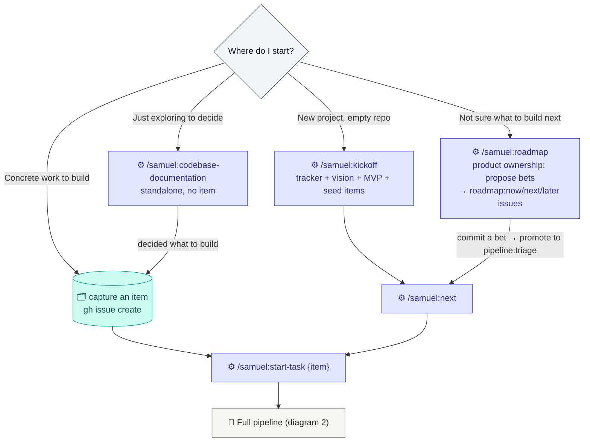
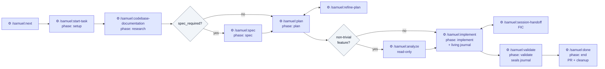
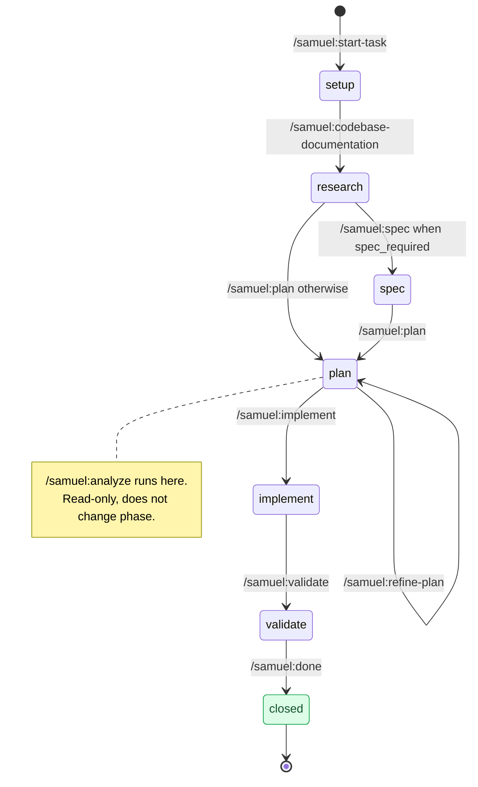
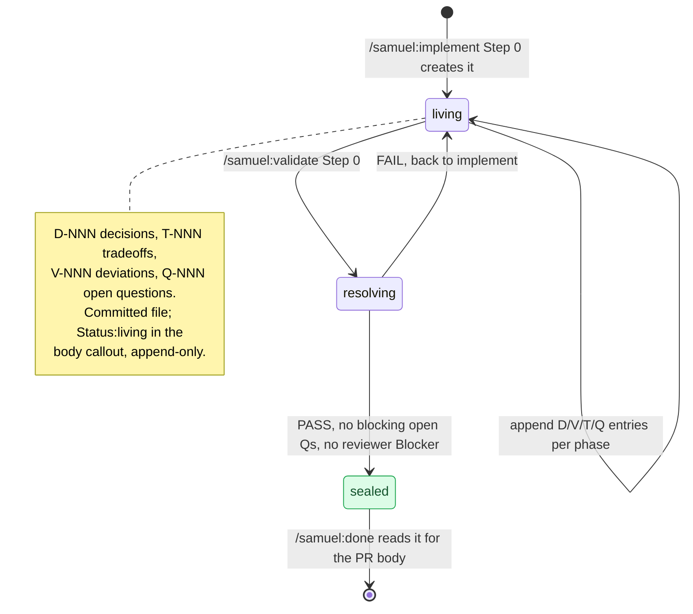
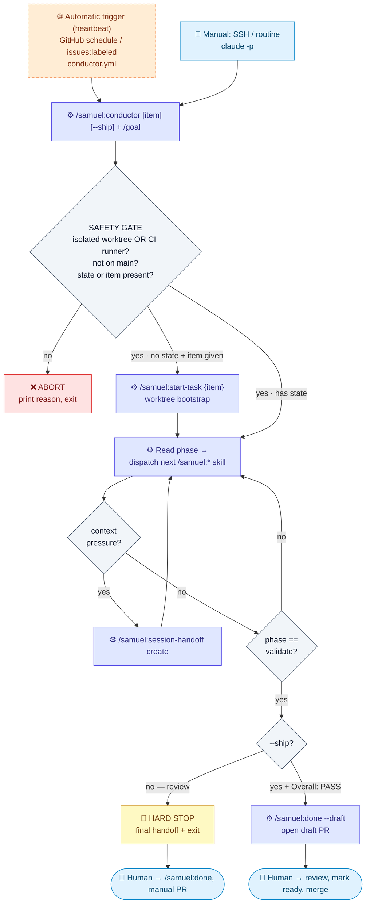
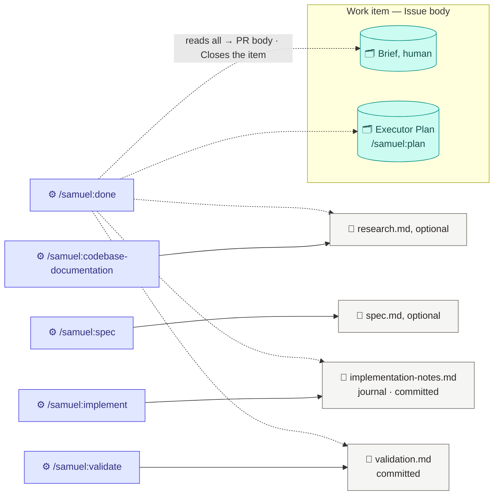

# Pipeline Flows — Reference Diagrams

Visual reference for the `samuel` plugin pipeline. These Mermaid diagrams are the canonical map of how the skills chain, which artifacts each produces, and how the `.claude/task-context.md` `phase` advances. They double as agent documentation — read this before driving the pipeline or building on it.

Bracketed steps `[ ]` are **optional gates** (`spec`, `analyze`). The pipeline degrades gracefully when they — and `CONSTITUTION.md` — are absent.

Related contracts: `tracker.md` (GitHub as SoT), `task-context.md` (frontmatter + phase), `plan-templates.md` (Brief + Executor Plan), `implementation-notes.md` (the journal), `github-operations.md` (the adapter).

## 1. Entry points — where to start

The `feature dir` and `phase` tracking are bootstrapped by `/samuel:start-task`. Without a task there is no `task-context.md`, so skills run **standalone** (write to `docs/research/` loose, no phase). Pick the entry that matches your situation.

> A TL;DR block and a one-line Brief are enough to capture an item — the plan fills the rest later. The TL;DR is the floor, not extra ceremony: an item too vague to state as *what / why / caveat* isn't captured, it's a note to self.

> **Discovery vs delivery.** `/samuel:roadmap` is upstream of everything else: it decides *what* to build (bets as `roadmap:*` issues). Committing a bet promotes it to `pipeline:triage`, where delivery begins. `/samuel:kickoff` seeds the first bets at project start; `/samuel:roadmap` keeps the direction fresh after.

> Anti-pattern: researching and planning at length in standalone mode, then trying to fold it into the pipeline. You end up reconciling loose docs against the feature dir. A one-line task up front avoids it.

## 2. Full pipeline — R → [S] → P → [A] → I → V

The happy path bracketed by `start-task` and `done`. Each skill owns its phase and advances `task-context.md`.

**Minimum happy path** (bug / small feat): `next → start-task → plan → implement → validate → done`.
**Full path** (feature with stakeholders): add `codebase-documentation`, `spec`, and `analyze`.

## 3. Phase state machine

The `phase` key in `.claude/task-context.md` is the single source of truth for where a feature is. This is what `/samuel:conductor` reads to decide the next step.

## 4. Implementation Notes journal lifecycle

`/samuel:implement` opens a living journal for sub-threshold choices that don't reach a recorded Issue decision. `/samuel:validate` resolves and seals it; `/samuel:done` synthesizes it into the PR body. Schema: `implementation-notes.md`.

## 5. Autonomous run — the conductor

> **Autonomy is a three-level scale, and this section is its top end.** Between the default (`interactive`, ask and wait) and the conductor (`autonomous`, record and continue) sits **`attended-auto`** — the human is present, so the run takes the obvious default and *announces* it instead of asking. It moves eight soft gates across `implement`, `done`, `next`, `start-task` and `session-handoff`; every hard stop below binds at all three levels. Switched on with `autonomy:` in `samuel.md`, never by a skill deciding for itself. Levels, the gate-by-gate table, and the recording contract: `autonomy.md`.

`/samuel:conductor` chains the pipeline unattended for cloud/overnight runs (`claude -p` + `/goal`; droplet or `caffeinate`). It can **bootstrap from an item id**, drives up to `validate`, then branches by mode: **review** (default) hard-stops before any PR; **ship** (`--ship`) runs the gate **and the independent reviewer** (validate Step 2.5), opening a **draft PR** via `/samuel:done --draft` only on `Overall: PASS`. The loop is started manually (`claude -p` over SSH) **or automatically** by GitHub (schedule / `issues:labeled`). Recipe + allowlist + multi-item loop: `skills/workflow/conductor/references/autonomous-run.md`. Automatic trigger (the heartbeat) + workflow template: `automated-trigger.md`.

> Every unattended assumption is recorded to the Issue (comment) + the journal + a final handoff — that trail is the morning review. Ship mode opens a PR only on `Overall: PASS` — a red gate **or** a Step 2.5 reviewer Blocker yields a handoff instead.

## 6. Feature dir artifacts — who writes what

The **Brief + Executor Plan** live in the Issue body. The **journal and validation are committed files** under `feature_dir` (`docs/features/<slug>/`), derived from `task-context.md`. `/samuel:done` reads them all to synthesize the PR.

## The unknowns seam (`find-unknowns`)

`/samuel:find-unknowns` (map-vs-territory audit — `skills/meta/find-unknowns/`) is wired into the pipeline as **suggested, never auto-run**, and only when an *observable* heuristic fires. The autonomous path is the exception — there the preflight verdict is a hard gate, because nobody is watching the assumption that turns out wrong.

**The asymmetry:**

- **Interactive** — a skill that sees a heuristic fire says so and offers the skill. The dev decides; the offer costs one line of transcript.
- **Autonomous** (under `/samuel:conductor`, or headless CI with `GITHUB_ACTIONS=true`) — the `planned→ready` promotion REQUIRES a preflight verdict `READY`, and a fired drift check at pickup escalates to the same preflight. `HOLD` stops the run with the unknowns recorded.

**The observable heuristics** (canonical list — skills reference this table, never copy it):

| Stage | Heuristic (any one fires) | Interactive | Autonomous |
|---|---|---|---|
| **plan** (`/samuel:plan`) | AC empty or unmeasurable · no Out-of-scope · `TBD` markers in the Brief · the `pattern-scanner` returns nothing for code the plan assumes exists · the `planned→ready` promotion itself | suggest PREFLIGHT before the dev approves promotion | PREFLIGHT **mandatory**; `READY` required to promote |
| **pickup** (`/samuel:start-task`) | the `git log` drift check fired (commits touching plan-named files since the plan was written) | surface the drift + suggest PREFLIGHT | PREFLIGHT **mandatory**; `HOLD` refuses the pickup |
| **implement** (`/samuel:implement`) | plan-reality mismatch · open `Q-NNN` ≥ 3 in the journal | suggest AUDIT before re-planning | (the hard gates already stop the run) |
| **close** (`/samuel:done`) | the PR is agent-authored | suggest `--quiz` to the human | suggest in the output; the agent never runs it |

**Never gate on self-reported confidence.** "I'm 80% sure" is uncalibrated — a model's stated confidence tracks its fluency, not its correctness, and an agent that must clear a confidence bar learns to clear it. Every heuristic above is observable by something other than the agent's opinion of itself: a missing section, a marker string, a `git log` with output, a counter in the journal callout.

## Maintenance

Keep these diagrams in sync with the skills. When a skill changes a phase transition, an artifact path, or a gate condition, update the matching diagram here and the phase table in `task-context.md`.
